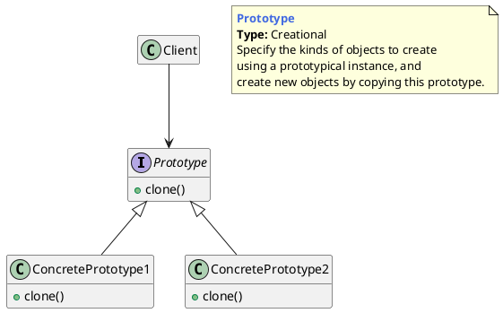
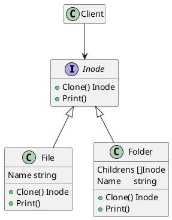

## 原型模式的概念

### 什么是原型模式

用原型实例指定要创建对象的种类，并通过拷贝这些原型的属性来创建新的对象。

>  Specify the kinds of objects to create using a prototypical instance,and create new objects by copying this prototype.





## 原型模式的举例

让我们尝试以os文件系统为例来理解它。 os文件系统具有`文件`和`文件夹`，而`文件夹本`身包含文件和文件夹。 每个文件和文件夹都可以由一个inode接口表示。 inode接口还具有`clone()`函数，`print()`只是为了输出测试信息。

### 类图




### 代码实现

inode.go

```go
package main

type Inode interface {
	Clone() Inode
	Print(string)
}
```


file.go

```go
package main

import "fmt"

type File struct {
	Name string
}

func (f *File) Print(s string) {
	fmt.Println(s + f.Name)
}

func (f *File) Clone() Inode {
	return &File{Name: f.Name + "_clone"}
}
```


folder.go

```go
package main

import "fmt"

type Folder struct {
	Childrens []Inode
	Name      string
}

func (f *Folder) Print(indentation string) {
	fmt.Println(indentation + f.Name)
	for _, i := range f.Childrens {
		i.Print(indentation + indentation)
	}
}

func (f *Folder) Clone() Inode {
	cloneFolder := &Folder{Name: f.Name + "_clone"}
	var tempChildrens []Inode
	for _, i := range f.Childrens {
		copy := i.Clone()
		tempChildrens = append(tempChildrens, copy)
	}
	cloneFolder.Childrens = tempChildrens
	return cloneFolder
}
```


main.go

```go
package main

import "fmt"

func main() {
	file1 := &File{Name: "File1"}
	file2 := &File{Name: "File2"}
	file3 := &File{Name: "File3"}
	folder1 := &Folder{
		Childrens: []Inode{file1},
		Name:      "Folder1",
	}
	folder2 := &Folder{
		Childrens: []Inode{folder1, file2, file3},
		Name:      "Folder2",
	}

	fmt.Println("\nPrinting hierarchy for Folder2")
	folder2.Print("  ")
    
	cloneFolder := folder2.Clone()
	fmt.Println("\nPrinting hierarchy for clone Folder")
	cloneFolder.Print("  ")
}
```


## 优缺点和应用场景

**优点**

1. 克隆模式通过内存拷贝的方式进行复制，比new的方式创建对象性能更好。
2. 通过深拷贝的方式，可以方便地创建一个具有相同属性和行为的另一个对象，特别是对于复杂对象，方便性尤为突出。


**缺点**

1. 构造函数不会被执行。


**使用场景**

1. 资源优化场景：类初始化需要消化非常多的资源，这个资源包括数据、硬件资源等。
2. 性能和安全要求的场景：通过new产生一个对象需要非常繁琐的数据准备或访问权限，则可以使用原型模式。
3. 一个对象多个修改者的场景：一个对象需要提供给其他对象访问，而且各个调用者可能都需要修改其值时，可以考虑使用原型模式拷贝多个对象供调用者使用。
4. 可配合备忘录模式做一些备份的工作。
5. 通常用于构建缓存和默认对象。


---

[Prototype Pattern in Go (Golang)](https://golangbyexample.com/prototype-pattern-go/)