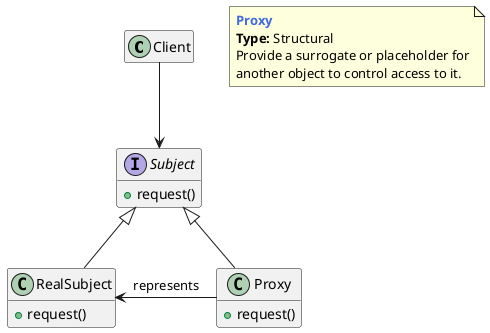
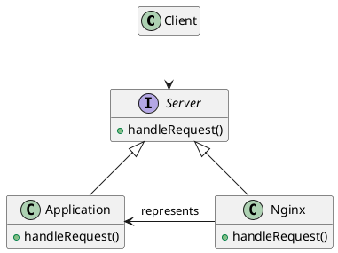

## 代理模式的概念

### 什么是代理模式

为其他对象提供一种代理以控制对这个对象的访问。它在不改变原始类（或叫被代理类）代码的情况下，通过引入代理类来给原始类`附加功能`。

>  Provide a surrogate or placeholder for another object to control access to it.




- **Subject**：抽象主题类可以是抽象类也可以是接口，是一个最普通的业务类型定义，无特殊要求。
- **RealSubject**：也叫做被委托角色、被代理角色。是业务逻辑的具体执行者。
- **Proxy**：也叫做委托类、代理类。它负责对真实角色的应用，把所有抽象主题类定义的方法限制委托给真实主题角色实现，并且在真实主题角色处理完毕前后做预处理和善后处理工作。


### 静态代理

- 代理类实现和源类相同的接口，每个类都单独编辑一个代理类

- 我们需要在代理类中，将原始类中的所有的方法，都重新实现一遍，并且为每个方法都附加相似的代码逻辑。

- 如果要添加的附加功能的类有不止一个，我们需要针对每个类都创建一个代理类。


### 动态代理

- 静态代理需要针对每个类都创建一个代理类，并且每个代理类中的代码都有点像模板式的“重复”代码，增加了维护成本和开发成本。对于静态代理存在的问题，我们可以通过动态代理来解决。
- 我们不事先为每个原始类编写代理类，而是在运行的时候动态地创建原始类对应的代理类，然后在系统中用代理类替换掉原始类。


## 代理模式举例

1. clinet请求先到nginx
2. nginx处理后在返回或转发给application




**proxy.go**

```go
package proxy

// Subject
type Server interface {
	handleRequest(string, string) (int, string)
}

// Application
type Application struct{}

func (a *Application) handleRequest(url, method string) (int, string) {
	if url == "/app/status" && method == "GET" {
		return 200, "Ok"
	}
	if url == "/create/user" && method == "POST" {
		return 201, "User Created"
	}
	return 404, "Not Ok"
}

// Nginx
type Nginx struct {
	App               *Application
	MaxAllowedRequest int
	RateLimiter       map[string]int
}

func NewNginxServer() *Nginx {
	return &Nginx{
		App:               &Application{},
		MaxAllowedRequest: 2,
		RateLimiter:       make(map[string]int),
	}
}

func (n *Nginx) handleRequest(url, method string) (int, string) {
	allowed := n.checkRateLimiting(url)
	if !allowed {
		return 403, "Not Allowed"
	}
	return n.App.handleRequest(url, method)
}

func (n *Nginx) checkRateLimiting(url string) bool {
	if n.RateLimiter[url] == 0 {
		n.RateLimiter[url] = 1
	}
	if n.RateLimiter[url] > n.MaxAllowedRequest {
		return false
	}
	n.RateLimiter[url] = n.RateLimiter[url] + 1
	return true
}
```


**proxy_test.go**

```go
package proxy

import (
	"testing"
)

func Test_Proxy(t *testing.T) {
	nginx := NewNginxServer()
	appStatusURL := "/app/status"
	createuserURL := "/create/user"

	type Args struct {
		url    string
		method string
	}

	tests := []struct {
		args  Args
		want1 int
		want2 string
	}{
		{args: Args{url: appStatusURL, method: "GET"}, want1: 200, want2: "Ok"},
		{args: Args{url: appStatusURL, method: "GET"}, want1: 200, want2: "Ok"},
		{args: Args{url: appStatusURL, method: "GET"}, want1: 403, want2: "Not Allowed"},
		{args: Args{url: createuserURL, method: "POST"}, want1: 201, want2: "User Created"},
		{args: Args{url: createuserURL, method: "GET"}, want1: 404, want2: "Not Ok"},
	}

	for _, tt := range tests {
		httpCode, body := nginx.handleRequest(tt.args.url, tt.args.method)

		if httpCode != tt.want1 || body != tt.want2 {
			t.Errorf("handleRequest() httpCode: %v, body: %v, httpCodewant: %v, bodywant: %v", httpCode, body, tt.want1, tt.want2)
		}
	}
}
```


## 优缺点和应用场景

**优点**

1. 代理模式能够协调调用者和被调用者，在一定程度上降低系统的耦合度。
2. 可以灵活地隐藏被代理对象的部分功能和服务，也可以增加额外的功能和服务。

**缺点**

1. 由于在客户端和真实主题之间增加了代理对象，因此有些类型的代理模式可能会造成请求的处理速度变慢。
2. 实现代理模式需要额外的工作，有些代理模式的实现非常复杂。

**应用场景**

1. 业务系统的非功能性需要开发，监控，统计，鉴权，限流，事物...
2. RPC
3. 缓存

---

[代理模式：代理在RPC、缓存、监控等场景中的应用](https://time.geekbang.org/column/article/201823)

[Proxy Design Pattern in Go (Golang)](https://golangbyexample.com/proxy-design-pattern-in-golang/)