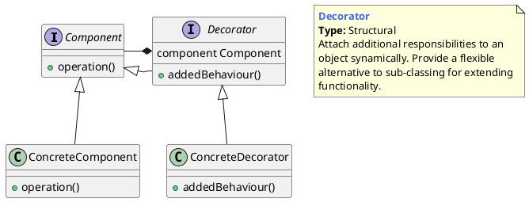
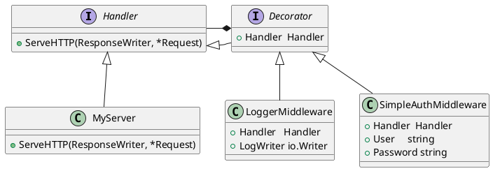

## 装饰器模式的概念

### 什么是装饰器模式

动态地给一个对象增加一些额外的职责，就拓展对象功能来说，装饰模式比生成子类的方式更为灵活。

> Attach additional responsibilities to an object dynamically. Decorators provide a flexible alternative to subclassing for extending functionality.




- `Component`是一个接口或者是抽象类，就是定义我们最核心的对象，也就是最原始的对象，如上面的成绩单。
- `ConcreteComponent`是最核心、最原始、最基本的接口或抽象类的实现，你要装饰的就是它。
- `Decorator`一般是一个抽象类，做什么用呢？实现接口或者抽象方法，它里面可不一定有抽象的方法呀，在它的属性里必然有一个private变量指向Component抽象构件。
- `ConcreteDecorator`把你最核心的、最原始的、最基本的东西装饰成其他东西。


## 装饰器模式举例

### server middleware


```go
package main

import (
	"fmt"
	"io"
	"log"
	"net/http"
	"os"
)

// ConcreteComponent
type MyServer struct{}

func (m *MyServer) ServeHTTP(w http.ResponseWriter, r *http.Request) {
	fmt.Fprintln(w, "Hello Decorator!")
}

// ConcreteDecorator
type LoggerMiddleware struct {
	Handler   http.Handler
	LogWriter io.Writer
}

func (l *LoggerMiddleware) ServeHTTP(w http.ResponseWriter, r *http.Request) {
	fmt.Fprintf(l.LogWriter, "Request URI: %s\n", r.RequestURI)
	fmt.Fprintf(l.LogWriter, "Host: %s\n", r.Host)
	fmt.Fprintf(l.LogWriter, "Content Length: %d\n", r.ContentLength)
	fmt.Fprintf(l.LogWriter, "Method: %s\n", r.Method)
	fmt.Fprintf(l.LogWriter, "-----------------------------------\n")
	l.Handler.ServeHTTP(w, r)
}

// ConcreteDecorator
type SimpleAuthMiddleware struct {
	Handler  http.Handler
	User     string
	Password string
}

func (s *SimpleAuthMiddleware) ServeHTTP(w http.ResponseWriter, r *http.Request) {
	user, pass, ok := r.BasicAuth()

	if ok {
		if user == s.User && pass == s.Password {
			s.Handler.ServeHTTP(w, r)
		} else {
			fmt.Fprintf(w, "User or password incorrect\n")
		}
	} else {
		fmt.Fprintln(w, "Error trying to retrieve data from Basic auth")
	}
}

func main() {
	fmt.Println("Enter the type number of server you want to launch from the" +
		" following:")
	fmt.Println("1.- Plain server")
	fmt.Println("2.- Server with logging")
	fmt.Println("3.- Server with logging and authentication")

	var selection int
	fmt.Fscanf(os.Stdin, "%d", &selection)

	var mySuperServer http.Handler

	switch selection {
	case 1:
		mySuperServer = new(MyServer)
	case 2:
		mySuperServer = &LoggerMiddleware{
			Handler:   new(MyServer),
			LogWriter: os.Stdout,
		}
	case 3:
		var user, password string

		fmt.Println("Enter user and password separated by a space")
		fmt.Fscanf(os.Stdin, "%s %s", &user, &password)

		mySuperServer = &LoggerMiddleware{
			Handler: &SimpleAuthMiddleware{
				Handler:  new(MyServer),
				User:     user,
				Password: password,
			},
			LogWriter: os.Stdout,
		}
	default:
		mySuperServer = new(MyServer)
	}

	http.Handle("/", mySuperServer)

	log.Fatal(http.ListenAndServe(":8080", nil))
}

```


## 优缺点和应用场景

**优点**

1.  使用装饰模式来实现扩展比使用继承更加灵活，它可以在不创造更多子类的情况下，将对象的功能加以扩展。
2. 可以动态地给一个对象附加更多的功能。
3.  可以用不同的装饰器进行多重装饰，装饰的顺序不同，可能产生不同的效果。
4.  装饰类和被装饰类可以独立发展，不会相互耦合；装饰模式相当于继承的一个替代模式。

**缺点**

1. 与继承相比，用装饰的方式拓展功能容易出错，排错也更困难。对于多次装饰的对象，调试寻找错误时可能需要逐级排查，较为烦琐。

**应用场景**

1. 需要扩展一个类的功能，或给一个类增加附加功能。
2.  需要动态地给一个对象增加功能，这些功能可以再动态地撤销。
3.  需要为一批的兄弟类进行改装或加装功能，当然是首选装饰模式。


---

[PlantUMLDesignPatterns](https://github.com/RafaelKuebler/PlantUMLDesignPatterns/blob/master/bridge.txt)

[Design Patterns in Golang: Decorator](http://blog.ralch.com/tutorial/design-patterns/golang-decorator/)

[Understanding the Decorator Pattern](https://tutorialedge.net/golang/go-decorator-function-pattern-tutorial/)

