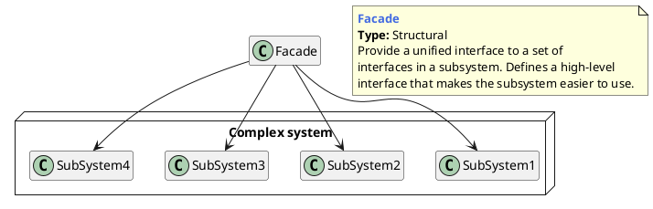

## 外观模式的概念

### 什么是外观模式

门面模式（Facade Pattern）也叫做外观模式，是一种比较常用的封装模式，其定义如下：要求一个子系统的外部与其内部的通信必须通过一个统一的对象进行。门面模式提供一个高层次的接口，使得子系统更易于使用。

> Provide a unified interface to a set of interfaces in a subsystem. Facade defines a higher-level interface that makes the subsystem easier to use.

- **外观角色（Façade）**：为子系统封装统一的对外接口，如同子系统的门面。这个类一般不负责具体的业务逻辑，只是一个委托类，具体的业务逻辑由子系统完成。
- **子系统（SubSystem）**：由多个类组成的具有某一特定功能的子系统。可以是第三方库，也可以是自己的基础库，还可以是一个子服务，为整个系统提供特定的功能或服务。

## 外观模式举例

[Facade Pattern](https://dev.to/shubhamzanwar/design-patterns-facade-pattern-9pb)

[Facade Design Pattern in Go (Golang)](https://golangbyexample.com/facade-design-pattern-in-golang/)

## 优缺点和应用场景

**优点**

1. 减少系统的相互依赖
2. 提高了灵活性
3. 提高安全性

**缺点**

1. 因为统一了调用的接口，降低了系统功能的灵活性。

**应用场景**

1. 为一个复杂的模块或子系统提供一个供外界访问的接口
2. 子系统相对独立——外界对子系统的访问只要黑箱操作即可
3. 预防低水平人员带来的风险扩散

**注意事项**

1. 一个子系统可以有多个门面
   1.  门面已经庞大到不能忍受的程度
   2. 子系统可以提供不同访问路径
2. 门面不参与子系统内的业务逻辑

---

[PlantUMLDesignPatterns](https://github.com/RafaelKuebler/PlantUMLDesignPatterns/blob/master/bridge.txt)

