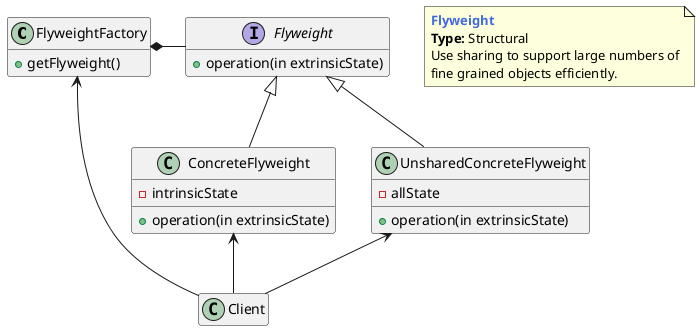

## 享元模式的概念

### 什么是享元模式

使用共享对象可有效地支持大量的细粒度的对象。指享元模式要求能够共享的对象必须是轻量级对象，也就是细粒度对象，因此享元模式又称为轻量级模式。

> Use sharing to support large numbers of fine-grained objects efficiently.

- **内部状态** (Intrinsic State)是存储在享元对象内部并且不会随环境改变而改变的状态，因此内部状态是可以共享的状态。
- **外部状态** (Extrinsic State)是随环境改变而改变的、不可以共享的状态。享元对象的外部状态必须由客户端保存，并在享元对象被创建之后，在需要使用的时候再传入享元对象内部。

- **Flyweight**（抽象享元角色）：它简单地说就是一个产品的抽象类，同时定义出对象的外部状态和内部状态的接口或实现。
- **ConcreteFlyweight**（具体享元角色）：具体的一个产品类，实现抽象角色定义的业务。该角色中需要注意的是内部状态处理应该与环境无关，不应该出现一个操作改变了内部状态，同时修改了外部状态，这是绝对不允许的。
- **UnsharedConcreteFlyweight**（不可共享的享元角色）：不存在外部状态或者安全要求（如线程安全）不能够使用共享技术的对象，该对象一般不会出现在享元工厂中。
- **FlyweightFactory**（享元工厂）：职责非常简单，就是构造一个池容器，同时提供从池中获得对象的方法。

## 享元模式举例

## 优缺点和应用场景

**优点**

1. 可以极大减少内存中对象的数量，使得相同对象或相似对象（内部状态相同的对象）在内存中只保存一份。
2. 享元模式的外部状态相对独立，而且不会影响其内部状态，从而使得享元对象可以在不同的环境中被共享。

**缺点**

1. 享元模式使得系统更加复杂，需要分离出内部状态和外部状态，这使得程序的逻辑复杂化。
2. 享元对象的内部状态一经创建不能被随意改变。

**应用场景**

1. 系统中存在大量的相似对象。
2. 细粒度的对象都具备较接近的外部状态，而且内部状态与环境无关，也就是说对象没有特定身份。
3. 需要缓冲池的场景。

---

[PlantUMLDesignPatterns](https://github.com/RafaelKuebler/PlantUMLDesignPatterns/blob/master/bridge.txt)

