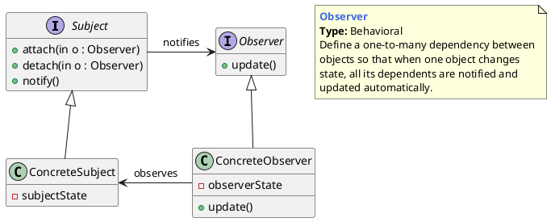

## 观察者模式的概念

### 什么是观察者模式

在对象间定义一种一对多的依赖关系，当这个对象状态发生改变时，所有依赖它的对象都会被通知并自动更新。

> Define a one-to-many dependency between objects so that when one object changes state,all its dependents are notified and updated automatically.

- **Subject被观察者**：定义被观察者必须实现的职责，它必须能够动态地增加、取消观察者。它一般是抽象类或者是实现类，仅仅完成作为被观察者必须实现的职责：管理观察者并通知观察者。

- Observer观察者：观察者接收到消息后，即进行update（更新方法）操作，对接收到的信息进行处理。

- **ConcreteSubject具体的被观察者**：定义被观察者自己的业务逻辑，同时定义对哪些事件进行通知。

- **ConcreteObserver具体的观察者**：每个观察在接收到消息后的处理反应是不同，各个观察者有自己的处理逻辑。

  

## 观察者模式举例

## 优缺点和应用场景

**优点**

1. 可以让两个没有关联的类一起运行，起中间转换的作用。
2. 提高了类的复用率。
3. 灵活性好，不会破坏原有系统。

**缺点**

1. 如果原有系统没有设计好（如Target不是抽象类或接口，而是一个实体类），适配模式将很难实现。
2. 过多地使用适配器，容易使代码结构混乱，如明明看到调用的是 A 接口，内部调用的却是B接口的实现。

**应用场景**

---

[PlantUMLDesignPatterns](https://github.com/RafaelKuebler/PlantUMLDesignPatterns/blob/master/bridge.txt)

