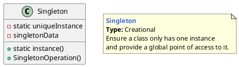

## 单例模式的概念
### 什么是单例模式

一个类只允许创建一个对象（或者实例），那这个类就是一个单例类，这种设计模式就叫作单例设计模式，简称单例模式（Singleton Design Pattern）。

> Ensure a class has only one instance,and provide a global point of access to it.

单例模式就是保证一个类有且只有一个对象（实例）的一种机制。单例模式用来控制某些事物只允许有一个个体，比如在我们生活的世界中，有生命的星球只有一个—地球（至少到目前为止在人类所探索到的世界中是这样的）。

## 单例模式的模型抽象
### 类图

### 代码实现

[demo1](https://gist.github.com/kwstars/51cfd38cdb61fce9fac29c8cdfde6a20) 

## 应用场景

1. 你希望这个类只有一个且只能有一个实例。
2. 项目中的一些全局管理类（Manager）可以用单例模式来实现。