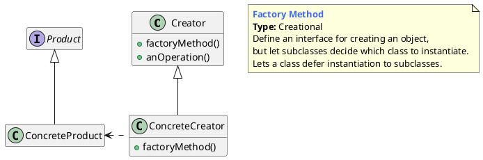

## 工厂方法的概念

### 什么是工厂方法模式

定义一个创建对象（实例化对象）的接口，让子类来决定创建哪个类的实例。工厂方法使一个类的实例化延迟到其子类。

>  Define an interface for creating an object,but let subclasses decide which class to instantiate. Factory Method lets a class defer instantiation to subclasses.


## 工厂方法的模型抽象

### 类图




工厂方法模式是一种创新的设计模式，它也是最常用的模式之一。这种模式提供了一种隐藏正在创建的实例的创建逻辑的方法。

客户端仅与工厂结构进行交互，并告知需要创建的实例类型。工厂类与相应的具体结构进行交互，并返回正确的实例。


1. 我们有`iGun`接口，它定义了枪支的所有方法
2. 然后定义一个`gun`的结构体, 实现`iGun`接口
3. `ak47`和`maverick`是具体的实现。既嵌入了`gun`的结构体，因此也间接实现了`iGun`的所有方法，因此属于`iGun`类型
4. 我们有一个`gunFactory`的结构体来创建`ak47`和 `maverick`。
5. `main.go`充当客户端，而不与`AK47`或`maverick`直接交互，它依赖于`gunFactory`创建的实例`AK47`和`maverick`


### 代码实现

```go
package main

import "fmt"

type iGun interface {
	setName(name string)
	setPower(power int)
	getName() string
	getPower() int
}

type gun struct {
	name  string
	power int
}

func (g *gun) setName(name string) {
	g.name = name
}

func (g *gun) getName() string {
	return g.name
}

func (g *gun) setPower(power int) {
	g.power = power
}

func (g *gun) getPower() int {
	return g.power
}

type ak47 struct {
	gun
}

func newAk47() iGun {
	return &ak47{
		gun: gun{
			name:  "AK47 gun",
			power: 4,
		},
	}
}

type maverick struct {
	gun
}

func newMaverick() iGun {
	return &maverick{
		gun: gun{
			name:  "Maverick gun",
			power: 5,
		},
	}
}

func getGun(gunType string) (iGun, error) {
	if gunType == "ak47" {
		return newAk47(), nil
	}
	if gunType == "maverick" {
		return newMaverick(), nil
	}
	return nil, fmt.Errorf("Wrong gun type passed")
}

func main() {
	ak47, _ := getGun("ak47")
	maverick, _ := getGun("maverick")
	printDetails(ak47)
	printDetails(maverick)
}

func printDetails(g iGun) {
	fmt.Printf("Gun: %s", g.getName())
	fmt.Println()
	fmt.Printf("Power: %d", g.getPower())
	fmt.Println()
}
```


## 优缺点和应用场景

优点：

- 解决了简单工厂模式不符合“开放-封闭”原则的问题，使程序更容易拓展。
- 实现简单。

缺点：

- 对于有多种分类的产品，或具有二级分类的产品，工厂方法模式并不适用。

**多种分类**：如我们有一个电子白板程序，可以绘制各种图形，那么画笔的绘制功能可以理解为一个工厂，而图形可以理解为一种产品；图形可以根据形状分为直线、矩形、椭圆等，也可以根据颜色分为红色图形、绿色图形、蓝色图形等。
**二级分类**：如一个家电工厂，它可能同时生产冰箱、空调和洗衣机，那么冰箱、空调、洗衣机属于一级分类；而洗衣机又可分为高效型的和节能型的，高效型洗衣机和节能型洗衣机就属于二级分类。


应用场景

- 客户端不知道它所需要的对象的类。
- 工厂类希望通过其子类来决定创建哪个具体类的对象。


---

[Factory Design Pattern in Go (Golang)](https://golangbyexample.com/golang-factory-design-pattern/)