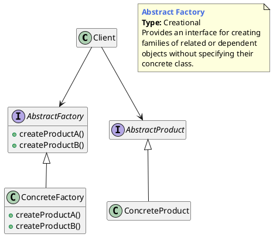

## 抽象工厂的概念

### 什么是抽象工厂模式

提供一个创建一系列相关或相互依赖的对象的接口，而无须指定它们的具体类。

>  Provide an interface for creating families of related or dependent objects without specifying their concrete classes.

## 抽象工厂的模型抽象

### 类图

工厂方法模式是一种创新的设计模式，它也是最常用的模式之一。这种模式提供了一种隐藏正在创建的实例的创建逻辑的方法。

客户端仅与工厂结构进行交互，并告知需要创建的实例类型。工厂类与相应的具体结构进行交互，并返回正确的实例。

### 代码实现

**[Demo1]()**

## 优缺点和应用场景

优点

- 解决了具有二级分类的产品的创建。

缺点

- 如果产品的分类超过二级，如三级甚至更多级，抽象工厂模式将会变得非常臃肿。
- 不能解决产品有多种分类、多种组合的问题。

应用场景

- 系统中有多于一个的产品族，而每次只使用其中某一产品族。
- 产品等级结构稳定，设计完成之后，不会向系统中增加新的产品等级结构或者删除已有的产品等级结构。