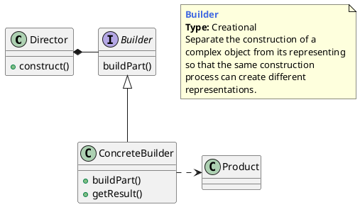
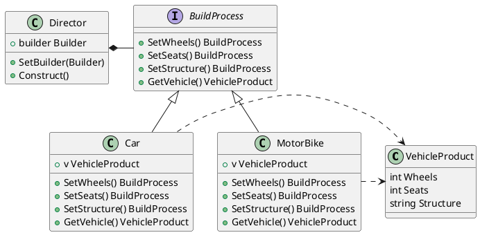

## 建造者的概念

### 什么是建造者模式

将一复杂对象的构建过程和它的表现分离，使得同样的构建过程可以获取（创建）不同的表现。

>  Separate the construction of a complex object from its representation so that the same construction process can create different representation.





**构建模式（升级版）中主要有三个角色，在设计构建模式时要找到并区分这些角色。**

1. `产品（ConcreteBuilder）`：即你要构建的对象。
2. `构建者（Builder）`：构建模式的核心类，负责产品的构建过程。
3. `调度者（Director）`：构建的管理类，负责管理每一种产品的创建数量和创建顺序。


### 建造者与其他模式的比较 

**建造者与工厂模式的区别**

- `工厂模式`关注的是整个产品（整体对象）的生成，即成品的生成

- `建造者模式`关注的是产品的创建过程和细节，一步一步地由各个子部件构建为一个成品


**建造者与组合模式的区别**

- `组合模式`：关注的是“整体-部分”的关系，也就是关注对象的内部组成结构。
- `区别` ：组合模式关注的是对象内部的组成结构，强调的是部分与整体的关系。构建模式关注的是对象的创建过程，即由一个一个的子部件构建一个成品的过程。  
- `联系`：组合模式和构建模式其实也经常被一起使用。还是以组装电脑为例，组合模式和构建模式一起使用


## 建造者模式的举例

### 机动车制造

我们将创建一个机动车制造商。 每种车辆的创建（ConcreteBuilder）的过程（被广泛称为算法）都大致相同-选择车辆类型，组装结构，放置车轮和放置座椅。如果您考虑一下，可以使用此描述来制造汽车和摩托车（两个Builder），因此我们将重复使用该描述来制造制造中的汽车。 在我们的示例中，调度者由`ManufacturingDirector`类型表示。


据我们所描述的，我们必须处置`Car`和`Motorbike`类型的建造者，以及一个称为`ManufacturingDirector`的独特总监来接管建造者和制造产品。 因此，车辆制造商示例的要求如下：

1. 我必须拥有能够构造车辆所需的配件
2. 使用汽车制造商时，`VehicleProduct`必须返回具有四个轮子，五个座椅和定义为Car的结构
3. 使用摩托车制造商时，`VehicleProduct`必须返回带有两个轮子，两个座椅和一个定义为Motorbike的结构
4. 任何`BuildProcess`建造者制造的`VehicleProduct`必须开放修改


#### 类图




#### 代码实现

builder.go

```go
package main

type BuildProcess interface {
	SetWheels() BuildProcess
	SetSeats() BuildProcess
	SetStructure() BuildProcess
	GetVehicle() VehicleProduct
}
```


product.go

```go
package main

type VehicleProduct struct {
	Wheels    int
	Seats     int
	Structure string
}
```


director.go

```go
package main

type Director struct {
	builder BuildProcess
}

func (d *Director) SetBuilder(b BuildProcess) {
	d.builder = b
}

func (d *Director) Construct() VehicleProduct {
	d.builder.SetSeats().SetStructure().SetWheels()
	return d.builder.GetVehicle()
}
```


car.go

```go
package main

type CarBuilder struct {
	v VehicleProduct
}

func NewCarBuilder() *CarBuilder {
	return &CarBuilder{
		v: VehicleProduct{
			Wheels:    4,
			Seats:     5,
			Structure: "Car",
		},
	}
}

func (c *CarBuilder) SetWheels() BuildProcess {
	c.v.Wheels = 4
	return c
}
func (c *CarBuilder) SetSeats() BuildProcess {
	c.v.Seats = 5
	return c
}
func (c *CarBuilder) SetStructure() BuildProcess {
	c.v.Structure = "Car"
	return c
}
func (c *CarBuilder) GetVehicle() VehicleProduct {
	return c.v
}
```


motorbike.go

```go
package main


type BikeBuilder struct {
	v VehicleProduct
}

func NewBikeBuilder() *BikeBuilder {
	return &BikeBuilder{
		v: VehicleProduct{
			Wheels:    2,
			Seats:     2,
			Structure: "MoterBike",
		},
	}
}


func (b *BikeBuilder) SetWheels() BuildProcess {
	b.v.Wheels = 2
	return b
}
func (b *BikeBuilder) SetSeats() BuildProcess {
	b.v.Seats = 2
	return b
}
func (b *BikeBuilder) SetStructure() BuildProcess {
	b.v.Structure = "Motorbike"
	return b
}
func (b *BikeBuilder) GetVehicle() VehicleProduct {
	return b.v
}
```


main.go

```go
package main

import "fmt"

func main() {
	director := Director{}

	bikeBuilder := NewBikeBuilder()
	director.SetBuilder(bikeBuilder)
	bike := director.Construct()
	fmt.Printf("%+v\n", bike)

	carBuilder := NewCarBuilder()
	director.SetBuilder(carBuilder)
	car := director.Construct()
	fmt.Printf("%+v\n", car)
}
```


输出

```
{Wheels:2 Seats:2 Structure:Motorbike}
{Wheels:4 Seats:5 Structure:Car}
```


## 优缺点和应用场景

**优点**

1. 将产品（对象）的创建过程与产品（对象）本身分离开来，让使用方（调用者）可以用相同的创建过程创建不同的产品（对象）。
2. 将对象的创建过程单独分解出来，使得创建过程更加清晰，能够更加精确地控制复杂对象的创建过程。
3. 针对升级版的构建模式，每一个具体构建者都相对独立，而与其他的具体构建者无关，因此可以很方便地替换具体构建者或增加新的具体构建者。

**缺点**

1. 增加了很多创建类，如果产品的类型和种类比较多，将会增加很多类，使整个系统变得更加庞杂。
2. 产品之间的结构相差很大时，构建模式将很难适应。

**应用场景**

1. 产品（对象）的创建过程比较复杂，希望将产品的创建过程和它本身的功能分离开来。
2. 产品有很多种类，每个种类之间内部结构比较类似，但有很多差异；不同的创建顺序或不同的组合方式，将创建不同的产品。


---

[PlantUMLDesignPatterns](https://github.com/RafaelKuebler/PlantUMLDesignPatterns)