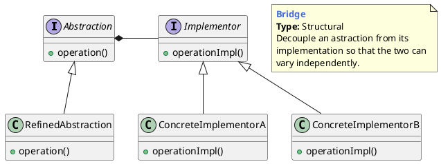
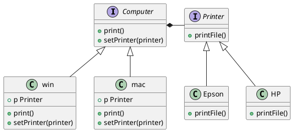

## 桥接模式的概念

### 什么是桥接模式

桥接模式被定义为：“将抽象和实现解耦，让它们可以独立变化。”在其他资料和书籍中，还有另外一种更加简单的理解方式：“一个类存在两个（或多个）独立变化的维度，我们通过组合的方式，让这两个（或多个）维度可以独立进行扩展。”

> Decouple an abstraction from its implementation so that the two can vary independently.




将一个大类分为两个独立的层次结构

- Abstraction（抽象化角色）：它的主要职责是定义出该角色的行为，同时保存一个对实现化角色的引用，该角色一般是抽象类。
- Implementor（实现化角色）：它是接口或者抽象类，定义角色必需的行为和属性。
- RefinedAbstraction（修正抽象化角色）：它引用实现化角色对抽象化角色进行修正。
- ConcreteImplementor（具体实现化角色）：它实现接口或抽象类定义的方法和属性。


**策略模式和桥接的区别**

- `桥梁模式`关注的是抽象和实现的分离，使得它们可以独立地发展；桥梁模式是结构型模式，侧重于软件结构。
- `策略模式`关注的是对算法、规则的封装，使得算法可以独立于使用它的用户而变化；策略模式是行为型模式，侧重于对象行为。


## 桥接模式举例

### 电脑与打印机




**bridge.go**

```go
package bridge

import "fmt"

// 抽象接口(Abstraction)
type Computer interface {
	Print()
	SetPrinter(Printer)
}

// Computer接口的Win的实现(Refined Abstraction)
type Win struct {
	p Printer
}

func (w *Win) Print() {
	fmt.Println("Print request for windows")
	w.p.PrintFile()
}

func (w *Win) SetPrinter(printer Printer) {
	w.p = (printer)
}

// Computer接口的Mac的实现(Refined Abstraction)
type Mac struct {
	p Printer
}

func (m *Mac) Print() {
	fmt.Println("Print request for mac")
	m.p.PrintFile()
}

func (m *Mac) SetPrinter(printer Printer) {
	m.p = printer
}

//实现接口(Implementor)
type Printer interface {
	PrintFile()
}

// Printer的Epson实现
type Epson struct{}

func (e *Epson) PrintFile() {
	fmt.Println("Printing by a EPSON Printer")
}

// Printer的HP实现
type HP struct{}

func (e *HP) PrintFile() {
	fmt.Println("Printing by a HP Printer")
}
```


**bridge_test.go**

```go
package bridge

import (
	"fmt"
	"testing"
)

func Test_Bridge(t *testing.T) {
	hp := &HP{}
	epson := &Epson{}
	win := &Win{}
	win.SetPrinter(hp)
	win.Print()
	fmt.Println("------")
	win.SetPrinter(epson)
	win.Print()
	fmt.Println("======")

	mac := &Mac{}
	mac.SetPrinter(epson)
	mac.Print()
	fmt.Println("------")
	mac.SetPrinter(hp)
	mac.Print()
}
```


### 不同类型和渠道的消息推送系统

#### if else 的实现版本

```go
package main

import "fmt"

// 报警级别
const (
	SEVERE uint32 = iota
	URGENCY
	NORMAL
	TRIVIAL
)

//通知类的接口
type ICommunication interface {
	Send(msg string)
}

//微信通知
type WeChat struct{}

func (w *WeChat) Send(msg string) {
	fmt.Printf("微信通知: %s", msg)
}

//语音通知
type Voice struct{}

func (w *Voice) Send(msg string) {
	fmt.Printf("语言通知: %s\n", msg)
}

// 通知的实现
type Notification struct {
	c ICommunication
}

func (s *Notification) notify(level uint32, msg string) {
	if level == SEVERE {
		s.c.Send(msg)
	} else if level == URGENCY {
		s.c.Send(msg)
	} else if level == NORMAL {
		s.c.Send(msg)
	} else if level == TRIVIAL {
		s.c.Send(msg)
	}
}

func main() {
	v := &Voice{}
	n := Notification{v}
	n.notify(SEVERE, "服务器严重报警")   // 语言通知: 服务器严重报警

	c := &WeChat{}
	n = Notification{c}
	n.notify(NORMAL, "一般故障")  // 微信通知: 一般故障
}
```


#### 桥接模式实现

**alarm.go**

```go
package main

import (
	"fmt"
)

//报警级别的接口
type SenderAbstraction interface {
	Alarm(msg string) error
}

//正常报警
type NormalAlarm struct {
	Sender SenderAPI
}

func (c *NormalAlarm) Alarm(msg string) error {
	c.Sender.Message(fmt.Sprintf("Message from NormalAlarm: %s", msg))
	return nil
}

//紧急报警
type EmergencyAlarm struct {
	Sender SenderAPI
}

func (c *EmergencyAlarm) Alarm(msg string) error {
	c.Sender.Message(fmt.Sprintf("Message from EmergencyAlarm: %s", msg))
	return nil
}

//发送接口
type SenderAPI interface {
	Message(string)
}

//通过微信发送
type WeChat struct{}

func (d *WeChat) Message(msg string) {
	fmt.Printf("微信报警: %s\n", msg)
}

//语音通知
type Voice struct {
}

func (d *Voice) Message(msg string) {
	fmt.Printf("语音报警: %s\n", msg)
}
```


**wire.go**

wire完成代码的依赖注入，通过`wrie`命令生成`wire_gen.go`的文件

```go
//+build wireinject

package main

import (
	"github.com/google/wire"
)

var wechat = wire.NewSet(wire.Struct(new(WeChat)), wire.Bind(new(SenderAPI), new(*WeChat)))

var voice = wire.NewSet(wire.Struct(new(Voice)), wire.Bind(new(SenderAPI), new(*Voice)))

func NewNormalAlarm() NormalAlarm {
	wire.Build(wechat, wire.Struct(new(NormalAlarm), "*"))
	return NormalAlarm{}
}

func NewEmergencyAlarm() EmergencyAlarm {
	wire.Build(voice, wire.Struct(new(EmergencyAlarm), "*"))
	return EmergencyAlarm{}
}
```


**main.go**

```go
package main

func main() {
	normal := NewNormalAlarm()
	emergency := NewEmergencyAlarm()

	normal.Alarm("服务器正常报警")
	emergency.Alarm("服务器宕机")
}
```


## 优缺点和应用场景

**优点**

1. **抽象和实现分离**：这也是桥梁模式的主要特点，它完全是为了解决继承的缺点而提出的设计模式。在该模式下，实现可以不受抽象的约束，不用再绑定在一个固定的抽象层次上。
2. **优秀的扩充能力**：看看我们的例子，想增加实现？没问题！想增加抽象，也没有问题！只要对外暴露的接口层允许这样的变化，我们已经把变化的可能性减到最小。
3. **实现细节对客户透明**：客户不用关心细节的实现，它已经由抽象层通过聚合关系完成了封装。

**应用场景**

1. **不希望或不适用使用继承的场景**：例如继承层次过渡、无法更细化设计颗粒等场景，需要考虑使用桥梁模式。
2. **接口或抽象类不稳定的场景**：明知道接口不稳定还想通过实现或继承来实现业务需求，那是得不偿失的，也是比较失败的做法。
3. **重用性要求较高的场景**：设计的颗粒度越细，则被重用的可能性就越大，而采用继承则受父类的限制，不可能出现太细的颗粒度。
4. 桥梁模式是非常简单的，使用该模式时主要考虑如何拆分抽象和实现，并不是一涉及继承就要考虑使用该模式，那还要继承干什么呢？桥梁模式的意图还是对变化的封装，尽量把可能变化的因素封装到最细、最小的逻辑单元中，避免风险扩散。因此读者在进行系统设计时，发现类的继承有N层时，可以考虑使用桥梁模式。

---

[PlantUMLDesignPatterns](https://github.com/RafaelKuebler/PlantUMLDesignPatterns/blob/master/bridge.txt)

[桥接模式：如何实现支持不同类型和渠道的消息推送系统？](https://time.geekbang.org/column/article/202786)

[Bridge Design Pattern in Go (Golang)](https://golangbyexample.com/bridge-design-pattern-in-go/)

