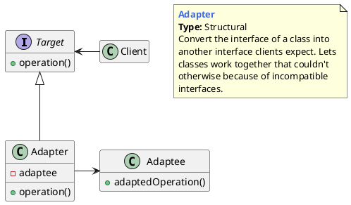
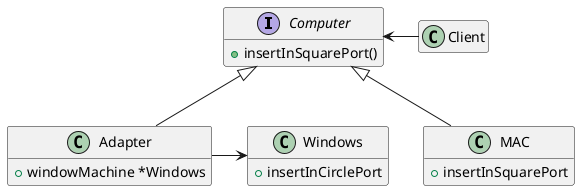

## 适配器模式的概念

### 什么是适配器模式

将一个类的接口变成客户端所期望的另一种接口，从而使原本因接口不匹配而无法一起工作的两个类能够在一起工作。

适配模式的作用：

1. 接口转换，将原有的接口（或方法）转换成另一种接口。
2. 用新的接口包装一个已有的类。
3. 匹配一个老的组件到一个新的接口。

> Convert the interface of a class into another interface clients expect. Adapter lets classes work together that couldn＇t otherwise because of incompatible interfaces.



- **目标（Target）**：即你期望的目标接口，要转换成的接口。
- **源对象（Adaptee）**：即要被转换的角色，要把谁转换成目标角色。
- **适配器（Adapter）**：适配模式的核心角色，负责把源对象转换和包装成目标对象。


## 适配器模式举例

### 接口适配




```go
package main

import "fmt"

// Target
type Computer interface {
	insertInSquarePort()
}

type MAC struct{}

func (m *MAC) insertInSquarePort() {
	fmt.Println("Insert square port into mac machine")
}

// Adaptee
type Windows struct{}

func (w *Windows) insertInCirclePort() {
	fmt.Println("Insert circle port into windows machine")
}

// Adapter
type WindowsAdapter struct {
	WindowMachine *Windows
}

func (w *WindowsAdapter) insertInSquarePort() {
	w.WindowMachine.insertInCirclePort()
}

type Client struct {}

func (c *Client) InsertSquareUsbInComputer(com Computer) {
	com.insertInSquarePort()
}

func main() {
	client := &Client{}
	mac := &MAC{}
	client.InsertSquareUsbInComputer(mac)
	windowsMachine := &Windows{}
	windowsMachineAdapter := &WindowsAdapter{
		WindowMachine: windowsMachine,
	}
	client.InsertSquareUsbInComputer(windowsMachineAdapter)
}
```


### 适配器模式在Go源码中的一个示例

`http.Handler`是非常有趣的适配器实现

```go
package main

import (
	"fmt"
	"log"
	"net/http"
)

type MyServer struct {
	Msg string
}

func (m *MyServer) ServeHTTP(w http.ResponseWriter, r *http.Request) {
	fmt.Fprintf(w, "Hello, World")
}
func main() {
	server := &MyServer{
		Msg: "Hello, World",
	}
	http.Handle("/", server)
	log.Fatal(http.ListenAndServe(":8081", nil))
}
```


```go
package main

import (
	"fmt"
	"log"
	"net/http"
)

func main() {
	http.HandleFunc("/", func(w http.ResponseWriter, r *http.Request) {
		fmt.Fprintf(w, "Hello, World")
	})
	log.Fatal(http.ListenAndServe(":8081", nil))
}
```


## 优缺点和应用场景

**优点**

1. 可以让两个没有关联的类一起运行，起中间转换的作用。
2. 提高了类的复用率。
3. 灵活性好，不会破坏原有系统。


**缺点**

1. 如果原有系统没有设计好（如Target不是抽象类或接口，而是一个实体类），适配模式将很难实现。
2. 过多地使用适配器，容易使代码结构混乱，如明明看到调用的是 A 接口，内部调用的却是B接口的实现。


**应用场景**

1. 封装有缺陷的接口设计
2. 统一多个类的接口设计
3. 替换依赖的外部系统
4. 兼容老版本接口
5. 适配不同格式的数据


---

[PlantUMLDesignPatterns](https://github.com/RafaelKuebler/PlantUMLDesignPatterns/blob/master/bridge.txt)

[适配器模式：代理、适配器、桥接、装饰，这四个模式有何区别？](https://time.geekbang.org/column/article/205912)

[Adapter Design Pattern in Go (GoLang)](https://golangbyexample.com/adapter-design-pattern-go/)