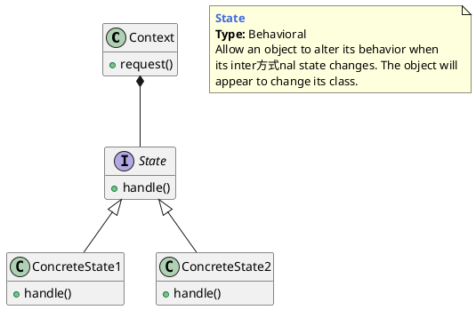

## 状态模式的概念

有限状态机，英文翻译是 Finite State Machine，缩写为 `FSM`，简称为状态机。状态机有 3 个组成部分：状态（State）、事件（Event）、动作（Action）。其中，事件也称为转移条件（Transition Condition）。


### 什么是状态模式

允许一个对象在其内部状态发生改变时改变其行为，使这个对象看上去就像改变了它的类型一样。




### 状态模式的实现方式

**分支逻辑法**

适用于简单逻辑


**查表法**

通过二位表来实现. 不适用动作方面的复杂逻辑


**状态模式**

适用于状态不多, 但操作逻辑比较复杂的场景.


## 状态模式举例

### 猜数字游戏

对于这个简单的游戏，我们有五个接受标准，基本上描述了游戏的机制。

1. 游戏会问玩家在输掉游戏之前会有多少次尝试。
2. 要猜的数字必须在0到10之间。
3. 玩家每输入一个数字来猜，重试的次数就会减少一次。
4. 如果重试的次数达到零，而数字仍然不正确，游戏就结束了，玩家就输了。
5. 如果玩家猜中了这个数字，玩家就赢了。

```go
package main

import (
	"fmt"
	"math/rand"
	"os"
	"time"
)

type GameState interface {
	executeState(*GameContext) bool
}

type GameContext struct {
	SecretNumber int  //猜的数字
	Retries      int  //剩余尝试次数
	Won          bool //是否赢
	Next         GameState
}

type StartState struct{}

func (s *StartState) executeState(c *GameContext) bool {
	c.Next = &AskState{}

	rand.Seed(time.Now().UnixNano())
	c.SecretNumber = rand.Intn(10)

	fmt.Println("Introduce a number a number of retries to set the difficulty:")
	fmt.Fscanf(os.Stdin, "%d\n", &c.Retries)

	return true
}

type AskState struct{}

func (a *AskState) executeState(c *GameContext) bool {
	fmt.Printf("Introduce a number between 0 and 10, you have %d tries left\n", c.Retries)

	var n int
	fmt.Fscanf(os.Stdin, "%d", &n)
	c.Retries = c.Retries - 1

	if n == c.SecretNumber {
		c.Won = true
		c.Next = &FinishState{}
	}

	if c.Retries == 0 {
		c.Next = &FinishState{}
	}

	return true
}

type FinishState struct{}

func (f *FinishState) executeState(c *GameContext) bool {
	if c.Won {
		println("Congrats, you won")
	} else {
		println("You lose")
	}
	return false
}

func main() {
	start := StartState{}
	game := GameContext{
		Next: &start,
	}
	for game.Next.executeState(&game) {
	}
}
```


## 应用场景

像游戏这种比较复杂的状态机，包含的状态比较多，我优先推荐使用查表法，而状态模式会引入非常多的状态类，会导致代码比较难维护。相反，像电商下单、外卖下单这种类型的状态机，它们的状态并不多，状态转移也比较简单，但事件触发执行的动作包含的业务逻辑可能会比较复杂，所以，更加推荐使用状态模式来实现。


### 状态模式的优缺点

优点：

（1）封装了状态的转换规则，在状态模式中可以将状态的转换代码封装在环境类中，对状态转换代码进行集中管理，而不是分散在一个个业务逻辑中。

（2）将所有与某个状态有关的行为放到一个类中（称为状态类），使开发人员只专注于该状态下的逻辑开发。

（3）允许状态转换逻辑与状态对象合为一体，使用时只需要注入一个不同的状态对象即可使环境对象拥有不同的行为。

缺点：

（1）会增加系统类和对象的个数。

（2）状态模式的结构与实现都较为复杂，如果使用不当容易导致程序结构和代码的混乱。

